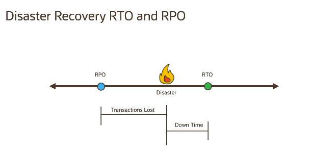
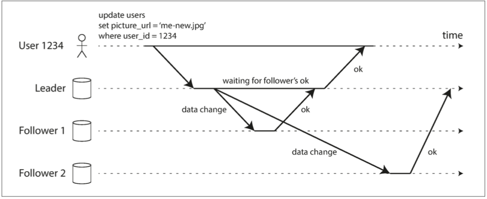
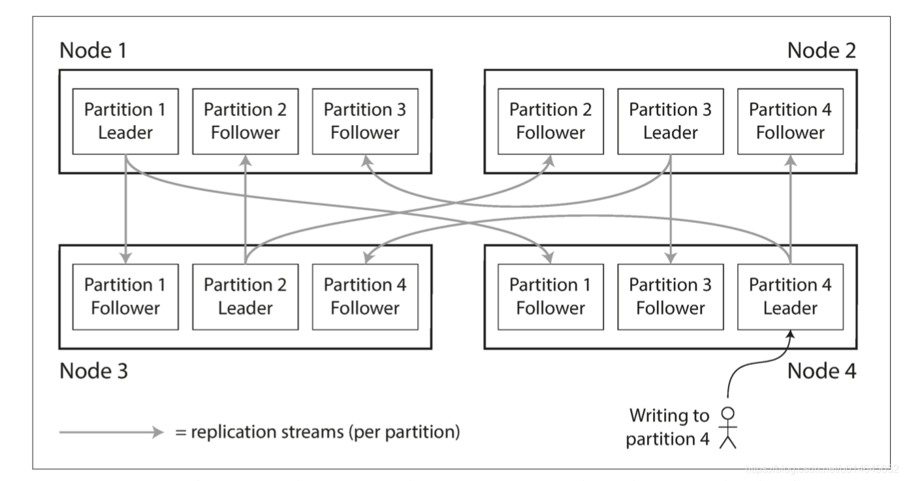
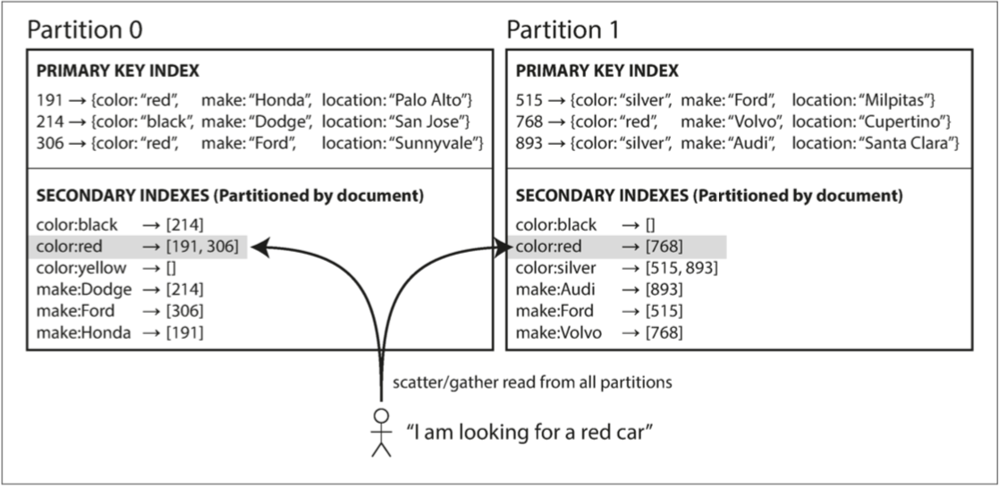
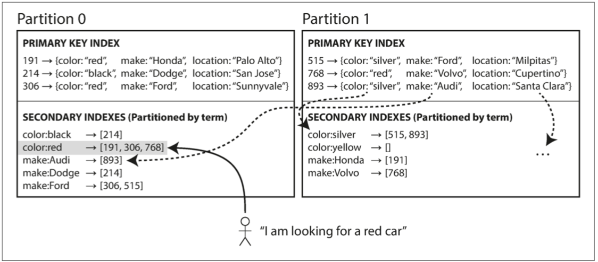
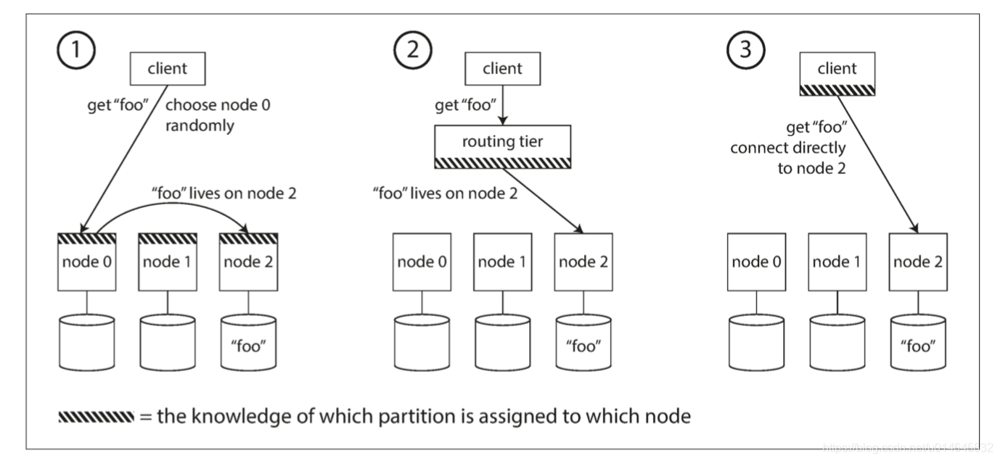

首先举3个例子

1. 有一个任务并行执行会有严重后果（考勤系统->收付款系统->...->银行），如何保护？redis分布式锁？定时任务自带的单机串行
2. 最终一致性保证，能向我们承诺什么？
3. tidb 小强db等等，或者号称干掉kafka的pulsar，追赶学习太慢，学会如何分析一个新系统，把握关键点。

我们常面临很多系统层面的问题，例如可扩展性、一致性、可靠性、执行效率以及可维护性等，这些要素如何取舍？市面上的各类工具，例如关系型数据库，NoSql存储系统，消息系统以及批处理，如何最大程度的利用它们为我们的应用服务？

在互联网行业，很多应用系统的核心挑战在于数据。本文尝试从理论出发结合常见应用（mysql、redis、kafka等，为简便起见统称为数据系统）两个角度，分析其内部原理与设计思路。

## 1 系统指标

通常情况下我们开发的应用/服务都不是孤立存在的，或多或少会依赖一些底层应用/服务，例如第三方服务接口，服务发现框架，数据库等等。因此我们在设计时也应该把这些依赖项所提供服务的能力纳入考虑范围，例如对方服务是否可靠，能承受的访问压力有多大，响应时间是多少等等；以此判断我们是否需要对它做降级，限流等等。

### SLA(Service Level Agreement)

服务水平协议（简称：SLA，全称：service level agreement）是在一定开销下为保障服务的性能和可靠性，服务提供商与用户间定义的一种双方认可的协定。

通常这个开销是驱动提供服务质量的主要因素。一个完整的SLA同时也是一个合法的文档，包括所涉及的当事人、协定条款(包含应用程序和支持的服务)、违约的处罚、费用和仲裁机构、政策、修改条款、报告形式和双方的义务等。同样服务提供商可以对用户在工作负荷和资源使用方面进行规定。

传统上，SLA包含了对服务有效性的保障，譬如对故障解决时间、服务超时等的保证，随着更多的商业应用的广泛开展，越来越需要SLA对性能（如响应时间）作出保障。

实际上，SLA的保障是以一系列的服务水平目标（SLO）的形式定义的。服务水平目标是一个或多个有限定的服务组件的测量的组合。一个SLO要求那些有限定的组件的测量值在限定范围里。SLA一般都有实现时间段和实现比例。实现比例被定义为SLA必须实现的时间与实现时段的比值。例如：在工作负荷＜100 transaction/s前提下，早上8点到下午5点服务响应时间＜85ms，服务有效率＞95%，在一个月内的总体实现比例 ＜97%。

[一个SLA的例子](https://coding.net/company/sla)

通常在使用某服务/应用之前，需要充分了解其SLA，知道它能做什么，做到什么程度，尽可能保证我们自己的系统被他拖垮。

### 性能指标
- 响应时间 = 网络响应时间 + 服务器端响应时间 + 客户端响应时间
- 资源使用率，常见的有CPU占用率、内存使用率、磁盘I/O、网络I/O。
- 吞吐量，指软件系统在每单位时间内能处理多少个事务/请求/单位数据的能力
- 并发用户数，用来度量服务器并发容量和同步协调能力，和吞吐量不同的是，它大多是占用Socket、句柄等操作系统资源。

### TP（Top Percentile，百分位点）
TP50、TP99和TP999等指标常用于系统性能监控场景。
例如在一个时间段内（如5分钟），统计该方法每次调用所消耗的时间，并将这些时间按从小到大的顺序进行排序，取第50%的那个值作为TP50值。

### 可靠性
- MTTF (Mean Time To Failure，平均无故障时间)，指系统无故障运行的平均时间，取所有从系统开始正常运行到发生故障之间的时间段的平均值。
- MTTR (Mean Time To Repair，平均修复时间)，指系统从发生故障到维修结束之间的时间段的平均值。
- MTBF (Mean Time Between Failure，平均失效间隔)，指系统两次故障发生时间之间的时间段的平均值。 

可靠性可能受到以下因素的影响：硬件故障/软件错误/人为失误。

### RTO/RPO

RTO(Recovery Time Objective)
复原时间目标：指系统存在数据丢失等故障的时间长度。例如系统故障4小时候恢复，RTO即为4小时。对于数据系统，主要考验数据中心发生故障时，业务切换到容灾系统或者备份系统的能力。

RPO(Recovery Point Objective)
复原点目标目标：指系统恢复后，恢复得来的数据所对应时间点。例如故障恢复后，系统丢失了故障恢复前最后一分钟的数据变更。对于数据系统，RPO反映了着数据中心复制的能力。

RTO和RPO指标并不是孤立的，而是从不同角度来反映数据中心的容灾能力。RPO指标来自于故障发生前，而RTO指标来自故障发生后，两者的数值越小，就能有效缩短业务正常到业务过渡期的时间间隔。完美的方案当然是RTO和RPO都为零，这表示当故障发生后，系统立即回复，而且完全没有数据丢失，要达到这样的目标系统设计是及其复杂的，而且造价也是非常昂贵的，也不一定有这个必要。

-------------------

## 2 分布式系统的挑战
### 故障与部分失效

单体应用通常遵循fail-fast原则，即以一种确定的方式运行，要么正常工作，要么出故障，而不是介于两者之间。如果发生了某种内部错误，我们宁可使系统崩溃，而不是带着错误逻辑强行返回结果。逻辑错误的结果往往比失败/异常更难处理。

理想状态下，系统隐藏了一切模糊环节，呈现出理想化的确定性模型。

但在分布式场景下，可能会出现部分失效。即系统一部分工作正常，其他部分出现某些难以预测的错误。涉及多节点和网络的系统几乎一定会遇到以下2个问题：

1. 网络失效。通过网络传输信息的延迟非常不固定，有时根本无从得知本次执行结果是否成功。

2. 服务器节点维修，需要在运行中下线某个节点。

通常构建大规模计算系统存在2个极端，传统企业数据中心位于2个极端之间。

#### 高性能计算
高性能计算系统包含成千上万个cpu构成庞大的集群，通常用于计算密集型的科学计算任务，例如天气预报，分子动力学等等。

通常会定期对任务状态进行快照，当某节点故障时，通常是停止整个集群的任务，然后从快照开始继续执行。因此这类系统更像是一个单节点系统。它将局部失效升级为整体失效，以简化故障处理模型。

#### 云计算

云计算定义迄今并不明确，但经验上来讲包含以下特征：通用计算机、多租户数据中心、IP以太网连接、弹性资源分配/计费。

### CAP
### BASE
### 不可靠网络
### 不可靠时钟
### 共识
### 系统模型与现实
### 小结

-------------------

## 3 一致性与共识
### 2PC/3PC
### ss
### Gossip protocol
### 2PC in MySQL
### Gossip protocol in Redis
### redis中的哨兵/Redis集群
### kafka
### 小结

-------------------

## 4 基础数据结构
### LSMTree-based

####LSMTree的推导过程

####LSMTree的特性

### Page-based

####B-Tree
####B+Tree

### InnoDb/MyISAM Index 
####Cluster Index

### RDB/AOF in Redis

### in Kafka

### 小结

-------------------

## 5 复制（Duplication）

每个保存数据库完整数据集的节点称之为副本，复制指多台机器上保留相同数据的副本；对于每一笔数据写入，所有副本都需要随之更新，否则某些副本将会出现不一致。

引入复制通常为了解决以下问题

- 高可用：即使系统的一部分（某台机器，或某个机房）出现故障，系统也能继续工作
- 容错性：允许应用程序在网络中断时继续工作
- 低延迟：使数据与用户在地理上接近（例如SET化）
- 可扩展：采用多幅本读取，大幅提高吞吐量

在复制时需要进行许多权衡：例如使用主从还是多主？同步复制还是异步复制？如何处理失效的节点/副本？如何处理读写请求失败？如何处理并发冲突？这些通常是数据库设计过程中的可选项，甚至是可配置项；其细节因数据库而异，但其原理在许多不同系统的实现中都类似。

复制的挑战在于如何处理持续更改的数据，通常存在以下几种拓扑结构
- 主从同步
- 多主同步
- 无主同步

### 主从复制
首先讲最简单的基于主节点的复制，即主从复制。

1. 指定某个副本为主副本（master）。client写入数据时，必须将写请求首先发给主副本，主副本首先将数据持久化。
2. 其他副本全部为从副本（slave）。master持久化数据之后，将数据变更作为复制日志（replica log）或更改流发送给所有从副本。每个从副本获取到变更后持久化到本地，且严格保持与主副本执行相同的写入顺序。
3. client读取数据时，可以在主副本或者从副本读取；但client只能往主副本写入数据。

MySQL，MongoDB等数据库内置了主从复制功能，但主从复制并不局限于数据库，在其他系统中也广泛应用，例如Kafka，redis等。

### 创建新节点

当需要增加副本数量，或者替换掉失效的副本时，就需要新增节点。

复制的难点在于数据源源不断的写入主库，处在不断变化中。因此为了在主库服务不中断的情况下复制到新节点，需要按照以下步骤：

1. 在某个时间点对主节点的数据生成一致性快照；这样复制时只需要读快照，而不是锁定主库读取数据；
2. 快照copy到从节点；
3. 从节点连接到主节点，请求快照对应的时间点之后，主节点发生的数据变更日志。在第一步创建快照时，快照就会与复制日志的某个位置相关，例如PostgreSQL中叫做log sequence number，MySQL中称之为binlog coordinates。
4. 从节点读取日志，并应用到自己的数据上。此过程成为“追赶”。随后从节点可以重复Step1~4。

创建新的从节点/副本的具体步骤因系统而异，有些是自动化，有些需要管理员手动介入。

### 节点失效

显然任何节点随时都可能因为故障或者维护而中断，甚至停机。复制的目的之一就是高可用，那么我们必须尽可能减小节点失效对整个系统带来的影响。

从节点上保存了从主节点传输来的复制日志。

#### 从节点失效：追赶式恢复

如果从节点崩溃后立即重启完成，或者遭遇网络闪断，就比较容易恢复。

1. 从节点找到最后一条成功处理过的复制日志；
2. 从节点继续处理完成未完成的复制日志；
3. 从节点继续请求主节点的复制日志，并处理数据变更，应用到本机的副本上。直到追上主节点的进度。

我们称之为“追赶式恢复”。

#### 主节点失效：节点切换

主节点失效后，需要进行“切换”

1. 选择某从节点，提升为主节点
2. 更新客户端，使之后的写请求发给新的主节点
3. 其他从节点重新指向新的主节点，并接受变更数据

切换既可以是手动由管理员实施，也可以由系统自动执行。

实践上，即使系统支持自动故障切换，很多运维团队仍然坚持**手动控制**整个切换流程。

自动切换的步骤如下：

1. 确认主节点失效。

   失效存在各种可能，例如系统崩溃，网络故障，甚至机房停电。远程服务没有能够确切得知故障原因的方法。

   因此大多数系统采用了基于超时的失效检测机制。即节点间互相频繁发送心跳信息，如果某节点在较长时间（比如30s）内无响应，即可认为该节点已失效

   是否事实上失效并不重要，重要的是系统整体需要达成这个共识。

2. 选举出新的主节点。

   可以通过选举，或者控制服务指派的形式选取主节点。

   但候选节点最好与原主节点的数据差异最小，即复制落后的最少，以最大限度优化RPO。

   系统内部需要对新的主节点**达成共识**。

3. 重新配置系统，使新主节点生效。

   客户端与其他从节点需要切换到新的主节点上。

   如果原主节点此时重新上线，他可能仍然自以为是主节点（参考前文不可靠网络与时钟），这时系统需要确保强迫原主节点降级为现在的从节点，并认可新的主节点。

其实上述流程中存在很多变数：

1. 如果使用了异步复制（很多系统都是如此），在失效之前，即将成为新主节点的那个从节点的数据复制没有追赶上原主节点的进度。
3. 脑裂，即系统中存在2个或多个节点都自认为是主节点，2个主节点都有可能接受写请求，因此造成数据冲突（多主复制会有专门的冲突解决方案）。
4. 检测节点是否失效时，很难设置合理的超时时间。如果设置过短会导致不必要的切换，例如负载突增造成拥塞，此时错误的主从切换会导致拥塞进一步恶化；反之，如果设置过长，RTO会很长。

### 复制日志

### 同步复制/异步复制/半同步复制
选择同步还是异步复制，是一个重要的设计选项。对于关系数据库系统，通常这是一个可配置选项；对于其他某些系统，也可能是设计时硬性规定好的。

从节点1是同步复制。主节点需要等待直到确认从节点1写入完成后，才会认为本次写入完成。即向client报告写入完成，并且新写入的数据对client可见。

从节点2是异步复制。主节点持久化之后，立即认为本次写入完成，不等待从节点2的反馈。

半同步复制是指，主节点不用等待全部从节点写入完成后才认为写入完成；而是设定一个阈值N，有N个从节点写入成功即认为成功并向client报告写入完成，此时主节点不关心其他从节点是否写入成功。

### 复制滞后与一致性
主从落后，主失效判定条件，脑裂等等。自动/手动切换

### 多主复制

#### 拓扑结构

#### 写冲突

### 无主复制

#### 节点失效时写入

#### Quorum机制

#### 并发写入

### Mysql的复制
### Redis的复制
### Kafka的复制

-------------------

## 6 数据分区（Partition）

数据分区指：对数据集的划分，即每一条数据（记录，行，或者文档）只属于某个特定的分区。

数据分区的主要目标：提高可扩展性，把数据和查询负载均匀分布在所有节点上；分布不均匀的现象叫做倾斜（skew）。

在单个分区上运行的查询，每个节点可以独立执行对自己的查询，因此可以通过添加更多的节点来扩大查询吞吐量。 复杂，大型的查询可能会跨越多个节点并行处理。

### 6.1 组合使用复制与分区

分区通常与复制结合使用，使得每个分区的副本存储在多个节点上，以提升系统的容错性。

一个节点可能存储多个分区，每个分区在多个节点都存有副本。由上图可见每个分区都有自己的主副本，一个节点可能包含一些分区的主副本和另一些分区的从副本。 大多数情况下，分区方案的选择与复制方案的选择是独立的。

### 6.2 分区策略

#### 对K-V数据的分区

- 基于主键区间分区
  + 区间段不一定要均匀分布，因为数据本身可能不均匀；
  + 区间边界可以手动确定或者自动选择；
  + 区间内可以以主键排序，便于查找；
  + 基于主键分区可能导致热点，例如以订单日期分区；
  + 使用多个字段组成主键可以避免热点，但会导致需要组装多个区间的查询结果。
  
- 基于主键哈希值分区
  + 好的哈希函数可以避免倾斜；
  + 分区边界采用均匀间隔，或者一致性哈希；
  + 哈希分区导致主键分散在多个分区不利于区间查询，区间查询需要在多个分区进行，最后再合并。

hash分区举例，Cassandra和MongoDb使用MD5，Voldemort使用Fowler-Noll-Vo计算hash；在MongoDB中，如果您使用了基于散列的分区模式，则任何范围查询都必须发送到所有分区。Riak ，Couchbase或Voldemort不支持主键上的范围查询。

复合主键：Cassandra采取的折衷的策略。 Cassandra中的表可以使用由多个列组成的复合主键来声明。键中只有第一列会作为散列的依据，而其他列则被用作Cassandra的SSTables中排序数据的连接索引。尽管查询无法在复合主键的第一列中按范围扫表，但如果第一列已经指定了固定值，则可以对该键的其他列执行有效的范围扫描。

#### 二级索引

二级索引主要的挑战在于：分区是按照主键划分的，因此二级索引不能规整的映射到分区中。

二级索引通常不唯一标识某条记录，而是用于加速特定值的查询。二级索引是关系数据库的必备特性（对列的索引，innoDb非聚簇索引），在文档数据库中也很常见（对字段的索引）。例如查询所有颜色为红色厂商为xx的汽车型号。

考虑到二级索引带来的复杂性各类数据应用对其支持程度不一，某些K-V存储直接不支持，例如HBase和Voldemort；Riak则刚开始支持；而对于ES和Solr，二级索引是其基本功能。

#### 二级索引-基于文档（document-based）（本地索引）

每个分区分别维护自己的二级索引，仅覆盖该分区中的文档，不关心存储在其他分区的数据。

写入数据库（添加，删除或更新文档）时，只处理文档所在的分区。因此，又被称为本地索引（local index）

这种索引方式对应分散/聚集（scatter/gather）查询，例如此时搜索红色汽车，需要将查询发送到所有分区，然后合并所有返回的结果。这种二级索引上的查询代价高昂，即使并行查询分区，也容易导致读延迟显著放大。

尽管如此，MongoDB，Riak，Cassandra，Elasticsearch，SolrCloud和VoltDB仍使用基于文档的二级索引。

#### 二级索引-基于词条（term-based）（全局索引）

为所有数据构建全局索引。例如把所有分区上的红色汽车条目都记录在索引中。

为避免倾斜，全局索引自身也需要分区。可选择与数据分区不同的分区策略，具体策略可以依照前文：按关键字直接分区利于区间查询；按关键字hash值分区不容易倾斜。

优点：读取更有效率，不需要分散/收集所有分区，客户端只需要向包含关键词的分区发出请求。

缺点：写入速度较慢且较为复杂，容易写放大。写入单个文档可能会影响多个二级索引，而二级索引的分区可能不同，甚至位于不同的节点上。

理想情况下，索引应该时刻保持最新，写入数据库的每个文档都会立即反映在索引中。但对于词条分区，这需要跨多个相关分区的分布式事务来支持，写入速度可能无法接受。

因此现有的数据库都不支持同步更新这种二级索引。实践中往往使用异步更新，Amazon DynamoDB通常在1秒内更新，但底层设施出故障时可能要等待很长时间。

#### 热点问题

在极端情况下，所有的读写操作都是针对同一个主键的，所有的请求都会被路由到同一个分区。例如，在社交媒体网站上，一个拥有数百万追随者的名人用户在做某事时可能会引发一场访问风暴。

当前大多数数据系统无法自动消除这种高度偏斜的负载，而指望应用程序减轻倾斜程度。

比如在应用程序层面**分割主键**，如果一个主键成为热点，一个简单的方法是在主键的开始或结尾添加一个随机数。只要一个两位数的十进制随机数就可以将主键分散为100种不同的*被分割主键*，存储在不同的分区中。

随之而来的是查询的复杂性，需要查询*被分割主键*所在的所有分区，并合并结果；此外还需要额外的元数据存储主键分割信息。

### 6.3 分区再平衡(Rebalancing）
数据并不总是固定存储在某个节点上，例如在以下情况时，
- 查询压力增加，需要更多CPU承担负载；
- 数据规模增加，需要更多磁盘，内存承担负载；
- 节点故障，需要其他机器接手。
需要将数据和查询请求从一个分区/节点迁移到另一个分区/节点上。

这个迁移过程叫做分区再平衡（Rebalancing），在此期间，需要满足：

- Rebalancing后，数据量，读写请求，负载在集群内更均匀的分布；
- Rebalancing期间，集群正常提供读写服务；
- 避免不必要的迁移，尽快，尽可能减少I/O和网络负载。

### 6.4 分区分配策略

数据 -> 分区 -> 节点

#### 取模

不要用取模，分区数变化会导致大量迁移。

#### 固定数量分区

  - 申请远超过节点数的分区数，为每个节点分配多个分区。
  - 集群中新增节点，可以从每个现有节点上匀走几个到新的分区；集群删除节点时反向操作。

  固定分区的优点是简单。因为迁移的是完整分区，且分区总数不变；因此仅需要更新分区与节点的关系，关键字到分区的映射关系保持不变。

  最坏的情况是除了正在迁移的分区，其他所有分区仍然可用。

  为简化系统，分区数量最好在创建时就定好，后期不要再改变；当然硬要拆分或合并分区也可以。

  - 分区数太大，每个分区内数据太小，会产生太多开销。
  - 分区数太小，每个分区内数据太多，会增加分区再平衡/节点故障恢复的代价。

  因此需要预估系统的数据量，并为未来的数据增长留有余地；总数据量不明确的情况下，很难确定恰到好处的分区数。

#### 动态分区

- 动态分区的分区边界可以随着数据量变化而动态变更，分区会对照阈值分裂与合并。
- 每个节点分配多个分区

动态分区的优点是分区数量可以自适应数据总量，系统开销小。

对于项目初始时的空数据库，因为分区为1个，可能在达到第一个分裂点之前所有请求由单台节点承担，其他节点空闲。

此时引入预分裂机制，预先在空数据库上分配一组初始分区，但前提是已知一些关键字的分布情况。

动态分区可以适用于*关键字区间分区*与*基于哈希的分区*。

#### 按节点比例分区

- 每个节点设置固定数量的分区，此时分区数与节点数成正比关系。
- 节点数不变，数据量增大时，分区会随之正比变大。因此随着数据量增长需要增加新的节点。
- 当新节点加入时，随机选取分区进行分裂，拿走一半的数据，在节点的分区数量较大时，是公平的。（Cassandra默认每个节点256个分区）
- 随机分裂的前提是使用基于哈希的分区，因为使用*关键字区间*时会倾斜，而哈希分布得更均匀。一致性哈希很适合这个场景。

分区再平衡是成本高昂的操作，自动再平衡可能会有一些风险，例如自动故障检测会将负载超重的节点认为已失效，此时启动分区再平衡会进一步加重网络，及节点间的负载，导致级联失效。

可以由系统提出建议，由管理员确认后执行。

分析一个Mysql分表的例子：

[分库分表之终极设计方案](https://www.cnblogs.com/liuqingzheng/p/10755148.html) 

### 6.5 请求路由

这是典型的服务发现场景：数据分散在多个分区/节点上，当客户端请求时如何知道连接哪个节点，发生分区再平衡时，节点与分区的关系还会变更。

主要有三种策略：

1. 客户端可以连接任意节点。如果某节点恰好持有需要的分区直接处理，否则将请求转发到下一个节点。（例如Redis）
2. 所有客户端请求发送到一个路由层。由路由层将请求转发到对应节点。路由层仅充当一个可以感知分区/节点的负载均衡器。（例如Kafka）
3. 客户端感知分区与节点分配关系。（例如Mysql自定义的分库分表规则，或者ShardingSphere）

那么，做出路由决策的组件为了感知到分区与节点的对应关系，通常有以下两种做法
- 基于独立的协调服务，例如节点使用Zookeeper注册自己的信息。（Kafka老版本）
- 节点间互相达成共识，例如使用Gossip协议。（Redis）

### Redis的分区

### Kafka的分区

### MySql的分区

-------------------

## 事务
  -
  -
  -

-------------------

## Streaming System
### 还没入门，以后再说

## Appendix

### 无共享架构（shared nothing architecture）

无共享架构（shared-nothing architecture）（有时称为水平伸缩（horizontal scale） 或向外伸缩（scale out））已经相当普及。在这种架构中，运行数据库软件的每台机器/虚拟机都称为节点（node）。每个节点只使用各自的处理器，内存和磁盘。节点之间的任何协调，都是在软件层面使用传统网络实现的。

无共享系统不需要使用特殊的硬件，所以你可以用任意机器——比如性价比最好的机器。你也许可以跨多个地理区域分布数据从而减少用户延迟，或者在损失一整个数据中心的情况下幸免于难。随着云端虚拟机部署的出现，即使是小公司，现在无需Google级别的运维，也可以实现异地分布式架构。

数据库构架设计中主要有Shared Everthting、Shared Nothing、和Shared Disk：

Shared Everything:一般是针对单个主机，完全透明共享CPU/MEMORY/IO，并行处理能力是最差的，典型的代表SQLServer

Shared Disk：各个处理单元使用自己的私有 CPU和Memory，共享磁盘系统。典型的代表Oracle Rac， 它是数据共享，可通过增加节点来提高并行处理的能力，扩展能力较好。其类似于SMP（对称多处理）模式，但是当存储器接口达到饱和的时候，增加节点并不能获得更高的性能 。

Shared Nothing：各个处理单元都有自己私有的CPU/内存/硬盘等，不存在共享资源，类似于MPP（大规模并行处理）模式，各处理单元之间通过协议通信，并行处理和扩展能力更好。典型代表DB2 DPF和Hadoop ，各节点相互独立，各自处理自己的数据，处理后的结果可能向上层汇总或在节点间流转。
我们常说的 Sharding 其实就是Share Nothing架构，它是把某个表从物理存储上被水平分割，并分配给多台服务器（或多个实例），每台服务器可以独立工作，具备共同的schema，比如MySQL Proxy和Google的各种架构，只需增加服务器数就可以增加处理能力和容量。

Shared nothing架构（shared nothing architecture）是一 种分布式计算架构。这种架构中的每一个节点（ node）都是独立、自给的，而且整个系统中没有单点竞争。
在一个纯Shared Nothing系统中，通过简单地增加一些廉价的计算机做为系统的节点却可以获取几乎无限的扩展。
Shared nothing系统通常需要将他的数据分布在多个节点的不同数据库中（不同的计算机处理不同的用户和查询）或者要求每个节点通过使用某些协调协议来保留它自己的应用程序数据备份 ，这通常被成为数据库Sharding。

--------------------------------------------
## 杂项 

图片来自这里 分布式数据系统——DDIA（二） https://blog.csdn.net/qq_40369829/article/details/105277575 有redis集群方案

